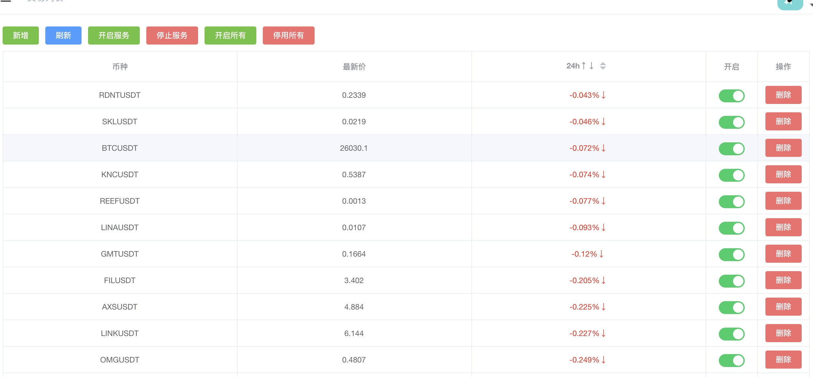
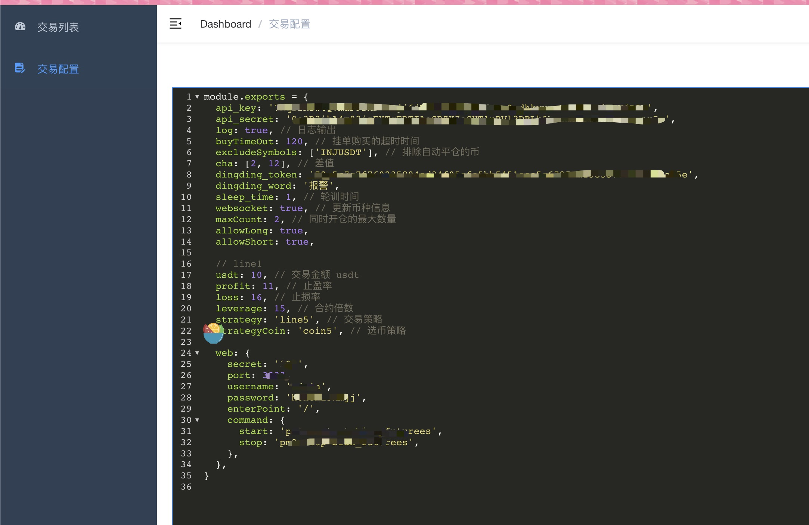
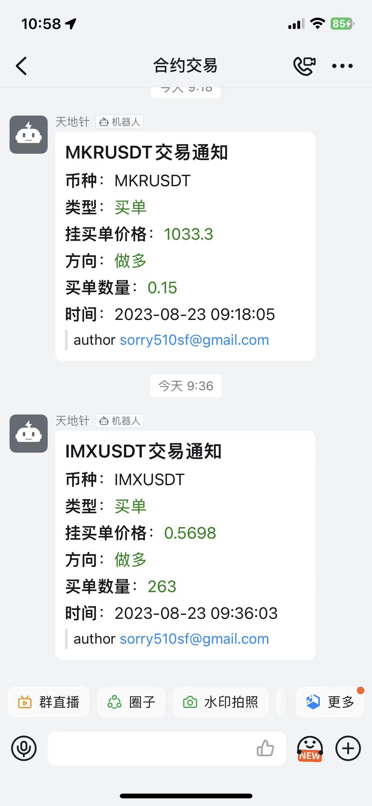

## 币安合约自动交易
- 自动交易
- 交易策略看 strategy 目录源码

## 以停止开发此项目, 使用 golang 重新开发
- 新项目地址[币安合约自动交易](https://github.com/sorry510/go_binance_futures)

## image



## dingding push


### install
```
pnpm install
```

### config
> 申请api_key地址: [币安API管理页面](https://www.binance.com/cn/usercenter/settings/api-management)

```
cp config.js.example config.js // 需自行修改交易配置
cp data/data.db.example data/data.db // 创建数据库
```

### 使用前注意事项
> 如果你的账号本身已经有合约仓位，请一定要在 config.js 文件中配 excludeSymbols, 排出掉你不想使用本程序自动交易的币，否则默认所有的仓位都会根据交易策略规则自动平仓

### start

```
node index.js // 开启后台服务
node web/app.js // 开启前端管理界面(只用来管理交易的币种和交易配置)
```

#### web 说明
>访问地址: http://ip:port # ip 为部署服务器ip，port 为 config.js 中 web.port
登录的账号密码为 config.js 文件中的  web.username 和 web.password

#### 交易列表按钮说明
##### 开启服务
> 对应的是 config.js 中 web.command.start 下的命令，需要自行配置

##### 关闭服务
> 对应的是 config.js 中 web.command.stop 下的命令，需要自行配置

##### 开启所有
> 开启所有币种

##### 停用所有
> 停用所有币种 

### 注意事项
- 由于币安交易所的 api 在大陆无法访问，请使用国外的服务器
- 请保证账户里有足够的 bnb 用于交易手续费
- 请保证现货账户有足够的 USDT
- 钉钉推送 1min 中内不要超过 20 条，否则会被封 ip

### 交易策略
> 参考 strategy 目录，默认了 5 种
> coin.js 用来选币，需要实现 getCoins 方法，通过 config.js 的 strategy 进行配置
> line.js 用来买卖，需要实现 getLongOrShort, canOrderComplete, autoStop 方法，，通过 config.js 的 strategyCoin 进行配置

### 免责申明
>！！！本项目不构成任何投资建议，投资者应独立决策并自行承担风险！！！
！！！币圈有风险，入圈须谨慎。！！！
